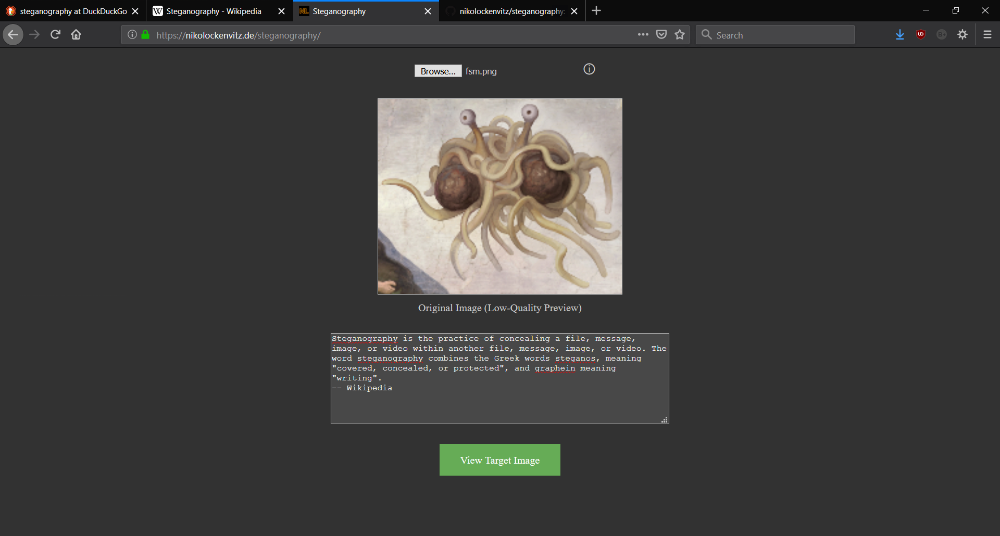

# Steganography
This is a simple implementation to hide a message inside an image.
You can upload an image, insert your message and then download the image.
When you upload an image which contains a secret message you can see this message in the textbox (otherwise it will look like mojibake).

This tool is available on https://nikolockenvitz.de/steganography but you can also download the repository and run it locally/offline.

If you really want to use steganography to communicate secretly, I highly recommend to encrypt the message before.

This application is still in development, some more advanced features are planned (e.g. hidden images, QR-Codes, encryption, ...).
If you like you can fork this repository and add some features or optimize existing code.
In case you have questions feel free to ask me.
